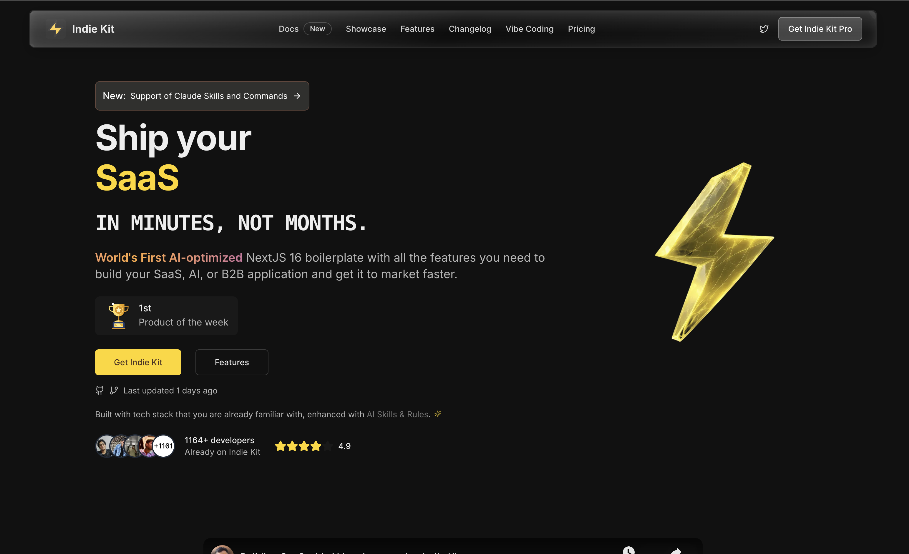

# Indie Kit - The AI-Native Next.js Starter Kit



<div align="center">

[](https://vercel.com/new/clone?repository-url=https://github.com/Indie-Kit/nextjs-saas-starter)
[](https://railway.app/new/template?template=https://github.com/Indie-Kit/nextjs-saas-starter)

[](https://github.com/Indie-Kit/nextjs-saas-starter/stargazers)
[](https://indiekit.pro/?utm_source=github-starter&utm_medium=readme&utm_campaign=lite)
[](https://indiekit.pro/app/discord)

</div>

# The AI-Native Next.js Starter Kit 🤖

**Engineered for modern development. Optimized for AI.**

This is the **Open Source / Lite Version** of [Indie Kit Pro](https://indiekit.pro/?utm_source=github-starter&utm_medium=readme&utm_campaign=lite). It combines a production-grade tech stack with **"AI Context Rules"** that empower LLMs (Cursor, Windsurf, Copilot) to understand your codebase, write bug-free code, and navigate your project autonomously.

[](https://opensource.org/licenses/MIT)
[](https://nextjs.org/)
[](https://www.typescriptlang.org/)

## 🚀 Features

### Core Stack - The Right Architecture

- 🏗️ **Next.js 16** (App Router) - Staying ahead of the curve.
- 🎨 **Tailwind CSS v4** + **Shadcn UI** - Beautiful, accessible UI.
- 🔐 **Better Auth** (Social + Magic Link) - Secure and simple.
- 🗄️ **Drizzle ORM** + **Bring Your Own Database** - Connect to **Supabase**, **Neon**, or any Postgres provider.
- 💳 **Stripe** Subscription Webhooks - Ready for monetization.
- 📁 **UploadThing** for file storage - Easy file uploads.
- 🌙 **Dark Mode** built-in - Because developers love it.

### Pre-built Pages

- 🏠 **Landing Page** (Hero, Features, Pricing, FAQ)
- 🔐 **Auth Pages** (Sign In, Sign Up)
- ⚙️ **App Layout** (Sidebar, Header, User Profile)
- 📄 **Legal Pages** (Privacy, Terms)

## 🤖 AI-Optimized Architecture

We've structured the codebase to be easily understood by LLMs (Cursor, Windsurf, Copilot, Antigravity). This means fewer hallucinations and better code generation, regardless of which tool you use.

- **Self-Documenting Code**: Your AI knows _exactly_ where auth lives (`.claude/skills/auth-handler`), how to migrate the DB (`.cursor/rules`), and where to put new components.
- **No Hallucinations**: We force the AI to use existing patterns (like `withAuthRequired`) instead of inventing broken ones.
- **One-Shot Prompts**: Paste a single command like `/bootstrap` and watch it scaffold your entire MVP plan.

💡 **Pro Tip**: To use this kit with Google's Antigravity or other AI agents that expect a `.agent` folder, simply rename `.claude` to `.agent`:

```bash
mv .claude .agent
```

## 🛠️ Getting Started

### 1. Clone & Install

```bash
git clone https://github.com/Indie-Kit/nextjs-saas-starter.git my-saas
cd my-saas
pnpm install
```

### 2. Environment Setup

Copy the example environment file and fill in your secrets:

```bash
cp .env.example .env
```

You will need:

- **Database URL**: Use **Supabase**, **NeonDB**, or any PostgreSQL provider.
- **Better Auth Secret**: Run `npx auth secret` to generate.
- **Stripe Keys**: For payment processing.
- **Social Keys**: (Google/GitHub, optional).

### 3. Database Setup

```bash
# Sync database schema to the database after adding new tables or modifying existing tables
pnpm run db:push
```

### 4. Run Development Server

```bash
pnpm dev
```

Open [http://localhost:3000](http://localhost:3000) to see your app.

## 🧠 The AI "Brain" (Exclusive)

This kit is designed to be "read" by LLMs. It includes:

- **`.cursor/rules`**: Context-aware rules for Cursor to understand project structure.
- **Prompt Library**: Pre-written prompts to generate features, DB schemas, and tests.
- **Self-Correction**: Setup to help AI fix its own linting errors.
- **Skills**: Specialized instructions for the AI to handle Auth, DB, and Payments correctly.

## 💎 Indie Kit Pro vs Starter

This starter is perfect for learning and building simple MVPs. For serious production apps, check out **[Indie Kit Pro](https://indiekit.pro/?utm_source=github-starter&utm_medium=readme&utm_campaign=table)**.

| Feature                         | Starter (Free) | Indie Kit Pro |
| :------------------------------ | :------------: | :-----------: |
| **Next.js 16 App Router**       |       ✅       |      ✅       |
| **Better Auth**                 |       ✅       |      ✅       |
| **Postgres + Drizzle**          |       ✅       |      ✅       |
| **Stripe Subscriptions**        |     Basic      |     Full      |
| **AI Navigation Rules**         |     Basic      |   Advanced    |
| **Dodo Payments**               |       ❌       |      ✅       |
| **Stripe Payments**             |       ❌       |      ✅       |
| **Lemon Squeezy Payments**      |       ❌       |      ✅       |
| **PayPal Payments**             |       ❌       |      ✅       |
| **Multi-Tenancy (Teams/Orgs)**  |       ❌       |      ✅       |
| **Role-Based Access Control**   |       ❌       |      ✅       |
| **User Impersonation**          |       ❌       |      ✅       |
| **Super Admin Dashboard**       |       ❌       |      ✅       |
| **Credit System (Usage Based)** |       ❌       |      ✅       |
| **Waitlist System**             |       ❌       |      ✅       |
| **Blog & Docs (MDX)**           |       ❌       |      ✅       |
| **Email Sequences (Inngest)**   |       ❌       |      ✅       |
| **Documentation Site**          |       ❌       |      ✅       |
| **Priority Support**            |       ❌       |      ✅       |

**_Get 1-1 mentorship with CJ for free when you upgrade to Pro._**

[**👉 Upgrade to Pro**](https://indiekit.pro/?utm_source=github-starter&utm_medium=readme&utm_campaign=upgrade)

### See Pro in Action

<a href="https://www.youtube.com/watch?v=Nps1LFxy8A8" target="_blank">
  
</a>

## 🤝 Community & Support

- **[Free Discord Community](https://indiekit.pro/app/discord)**: Join our community of indie hackers to ask questions and share your progress!
- **Twitter**: Follow [@cjsingg](https://x.com/cjsingg) for updates.
- **Issues**: Open a GitHub issue for bugs in the starter.

---

Built with ❤️ by [CJ](https://x.com/cjsingg).
